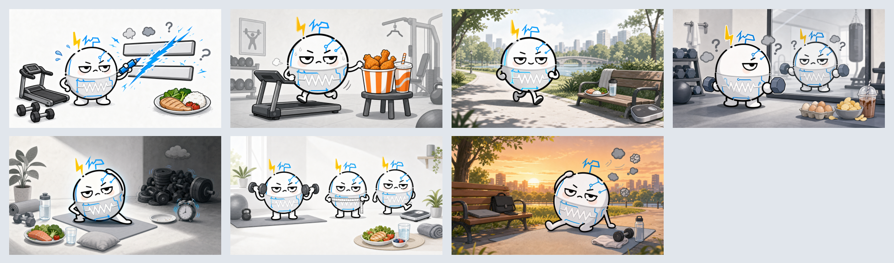

# 第 001 集交付｜健身公式不能直接画等号

这是“内耗儿绝缘体”的第一集正式视频，也是以后所有单集交付的参考样例。

## 状态

- 创建时间：2026-07-13 至 2026-07-15
- 当前阶段：已发布，数据观察中
- v1：七张横版图片、配音、字幕、缩放、转场、音乐和封面均已在剪映完成，并已手动导出
- v2：更自然、更短、更专业的七段口播已定稿；新版无字留白封面已生成
- 尚未归档：最终 v2 导出视频文件位置、实际抖音链接和完整发布数据
- 初始观测：约 40 次播放；由于发布时间窗、留存和互动数据尚未补齐，当前不能判断作品失败或被限流

## 本集目标

用一个轻松的健身话题完成账号第一次亮相，同时把内容自然带回账号主线：

> 健身可以释放压力，但不应该因为几条绝对化公式，变成新的焦虑和内耗。

本集不是把账号定位成健身号。健身只是“打工人释放压力”的一个轻入口。

## 原始话题

网上流传的五个公式：

1. 有氧 + 不控制饮食 = 变胖
2. 有氧 + 控制饮食 = 体重下降
3. 力量 + 不控制饮食 = 变壮
4. 力量 + 有氧 + 控制饮食 = 皮质醇飙升
5. 力量 + 控制饮食 = 体脂率降低

核心纠正不是把五句话全部反过来，而是指出：这些说法把有条件的概率关系写成了必然等式。

完整核验见 [研究与科学依据](01-research/sources.md)。

## 交付预览

七张横版分镜：

新版无字留白封面：

## 最终内容结构

全片使用七个画面：

1. 开场：五个公式都不能直接画等号。
2. 有氧加不控制饮食，不等于必然变胖。
3. 有氧加合理饮食，更可能减重。
4. 力量训练加不控制饮食，不等于自动变壮。
5. 力量、有氧和控制饮食，不等于皮质醇必然飙升。
6. 力量训练配合合理饮食，更有利于改善身体成分。
7. 总结：健身是释放压力，别让它成为新的内耗。

最终 v2 口播见 [narration-v2.md](02-script/narration-v2.md)。

## 从头到尾经历了什么

### 1. 从“健身号”纠正为“打工人减压账号”

一开始讨论的是五个健身公式，但账号真正要表达的不是专业健身教学，而是年轻人的工作、生活、金钱和关系压力。最后确定：第一集用健身轻松开篇，内容必须在结尾回到释放压力和减少内耗。

### 2. 先纠正结论，再决定画面

逐条判断五个等式的问题：

- 体重趋势由长期能量摄入与消耗共同决定。
- 控制饮食不等于不吃饭。
- 增肌需要训练刺激、营养和恢复。
- 运动后皮质醇短期升高是正常生理反应。
- 力量训练配合合理饮食更有利于减脂和保留肌肉。

这一步避免了为了追热点而重复错误结论。

### 3. 视觉从“知识卡片”转向“角色叙事”

早期版本接近知识 PPT，信息清楚但不够轻松、也不够吸睛。随后尝试过火柴人、胖猫等方向，最终决定不用通用动物，而是固定使用账号自己的白色小电阻人。

之后又根据抖音同类作品的观看方式，把画面从竖版卡片改成横版 16:9，用一个角色动作讲清一个观点。

### 4. 完成七张横版分镜图

七张正式横版分镜在 [03-visuals/horizontal](03-visuals/horizontal)；联系表在 [horizontal-contact-sheet.png](03-visuals/horizontal-contact-sheet.png)。

旧版竖图保存在 [03-visuals/vertical-v1](03-visuals/vertical-v1)，只作为历史过程，不再作为当前成片首选。

### 5. 在剪映完成第一轮剪辑

实际操作包括：

- 导入七张图片。
- 设置图片时长。
- 使用 AI 配音并识别字幕。
- 给七张图片加入轻微缩放。
- 加入统一转场。
- 加入低音量音乐。
- 完成封面。
- 导出 v1 成片。

旧版剪辑单见 [storyboard-v1.md](05-editing/storyboard-v1.md)。

### 6. 解决“七张图和配音对不上”

第一次把整篇文案交给智能文案后，工具把七段话继续拆成很多小语音块，导致图片和音频错位。

最终处理方式：

1. 删除错位音频。
2. 把口播严格拆成七组。
3. 每组只对应一张图片。
4. 先逐组对齐，再统一检查时长和动效。

这个问题成为以后所有视频的固定规则：一图一段配音，不先整篇生成。

### 7. 第二轮压缩口播

v1 的开场“方向有些没错，但不能画等号”偏书面；主体解释也略长。v2 改为：

- 用“最近经常刷到……”自然开篇。
- 每段先说“第一个、第二个”，保留停顿。
- 每段只留结论和一个必要解释。
- 用“长期能量平衡、正常生理反应、身体成分”等更准确的词。
- 结尾用一句话回到释放压力和减少内耗。

### 8. 重新制作无字留白封面

新版封面只保留准备开讲的小电阻人，角色放在右侧，左侧留出大面积空白，发布时再添加短标题。成品见 [cover-clean-16x9.png](03-visuals/cover/cover-clean-16x9.png)。

## 本集目录

~~~text
001-fitness-formulas-no-equals/
├─ README.md
├─ 01-research/       科学依据和结论边界
├─ 02-script/         v1 内容、v1 字幕和最终 v2 口播
├─ 03-visuals/        横版分镜、旧竖图和新版封面
├─ 04-prompts/        场景与封面提示词
├─ 05-editing/        剪辑参数、顺序和历史脚本
├─ 06-publishing/     标题、配文和发布设置
└─ 07-deliverables/   导出状态和最终文件说明
~~~

## 这集留下的通用经验

1. 先确定账号主线，再决定热点从什么角度切入。
2. 先核验事实，再写情绪和观点。
3. 一张图只承担一个观点。
4. 一张图对应一个独立语音段落。
5. 口播要像人自然开口，不像念报告。
6. 画面要有故事动作，不能只是知识 PPT。
7. 固定 IP 比每次换猫、火柴人或真人更有账号识别度。
8. 封面单独制作，并为后期标题留白。
9. 对齐语音和图片以后，再做缩放、转场和音乐。
10. 未记录到仓库的关键决定，等于下一台电脑不知道。

## 下一步

1. 保留当前作品，不因初始约 40 次播放立即删除、重发或投放 DOU+。
2. 在发布后 24 小时和 72 小时补录播放、2 秒或 5 秒留存、平均观看、完播率、互动和新增关注。
3. 根据留存位置判断开场、节奏或选题问题，不只依据播放量下结论。
4. 继续制作第 002 集，用下一条作品形成可比较样本。
5. 具体诊断方法见 [首次发布表现复盘](06-publishing/performance-review.md)。
