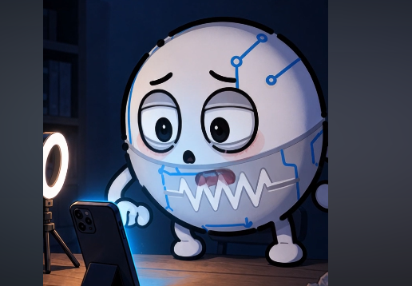

# 第 002 集剪辑参数 v3｜嘴部锁定修正版（历史版本）

> 本版将嘴完全锁死，限制过度，已由 [v4 单嘴可动修正版](editing-v4.md) 取代。

## 修正原因

v2 可灵测试要求角色嘴巴开合，模型误把灰色腰带中的锯齿电阻纹识别成牙齿，并生成粉色第二张嘴。v3 不再生成口型，所有说话声音都在剪映后期添加。

错误帧记录：

正确结构：唯一的嘴是当前输入图中白色脸部中央、灰色腰带上方原本已有的嘴形；在这张错误帧对应的原图中，它是小黑点。其他分镜可能是张嘴或咧嘴，应保持各自原图形状不动。灰色腰带和白色锯齿始终只是电阻元件图案。

## 时间表

| 顺序 | 可灵生成时长 | 剪映建议使用 | 口播 |
|---:|---:|---:|---|
| 1 | 5 秒 | 约 3.2 秒 | 来，让我看看……刚发的作品，是不是已经偷偷爆了。 |
| 2 | 5 秒 | 约 2.6 秒 | 嗯？才四十多个播放？数据还没加载完吧？ |
| 3 | 5 秒 | 约 2.7 秒 | 不是……点赞、评论、收藏，怎么全是零啊！ |
| 4 | 5 秒 | 约 3 秒 | 这不可能。看我略施法力，给它念个推流咒！ |
| 5 | 5 秒 | 约 3.3 秒 | 没想到啊，视频刚出征，我先败在刷新键上了。 |

总原则：先用可灵生成五段 5 秒素材，再按真实配音截取；不为追求口型同步牺牲角色稳定性。
