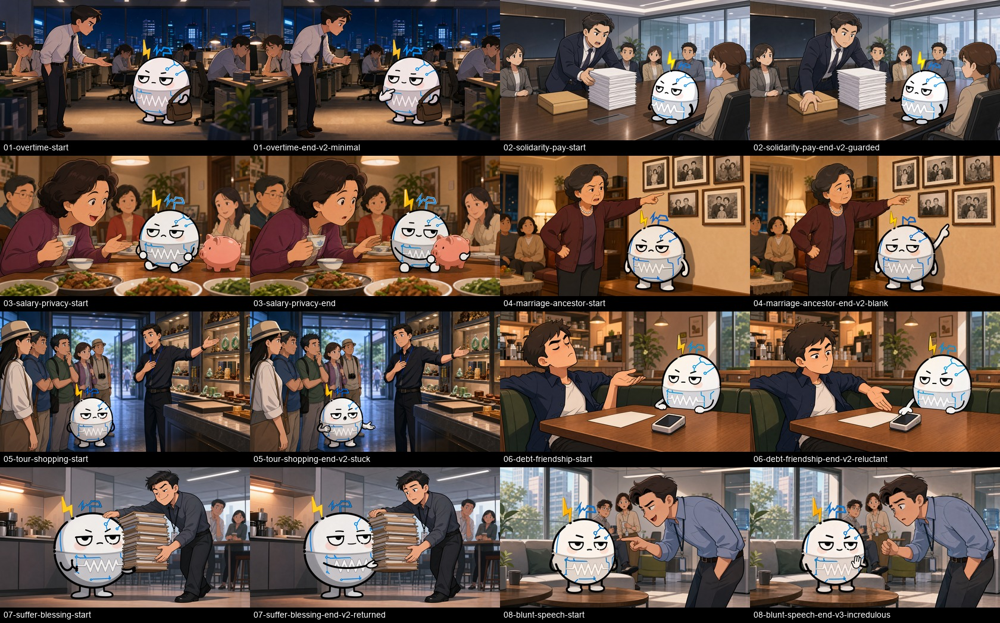

# 第 003 集视觉规划

- 当前状态：八组当前首尾帧已完成视觉检查；01、02、04、05、06、07 已按“一个主要动作＋一个轻微心理反应”重做尾帧 v2，03 保留原图，08 使用“没想到你敢反嘴”尾帧 v3。
- 实际规格：约 1672×941，横版近标准 16:9；剪辑时按项目画布缩放到 1920×1080。
- 固定角色：白色小电阻人。
- 实际数量：8 个场景 × 起始帧/收尾帧各 1 张，共 16 张。
- 图片本身不生成文字、字幕、Logo 或水印。
- 每组起始帧和收尾帧保持相同场景、服装、光线和镜头轴线，方便后续首尾帧图生视频。
- 角色已检查：白色脸部只有腰带上方一张嘴；灰色腰带和白色锯齿保持封闭硬质结构，没有舌头、牙齿或第二张嘴。

## 联系表

- 文件尺寸与 SHA-256：[horizontal-v1/MANIFEST.md](horizontal-v1/MANIFEST.md)

## 文件清单

| 场景 | 起始帧 | 收尾帧 |
|---:|---|---|
| 01 深夜加班 | [start](horizontal-v1/01-overtime-start.png) | [v2 minimal end](horizontal-v1/01-overtime-end-v2-minimal.png) |
| 02 团结与待遇 | [start](horizontal-v1/02-solidarity-pay-start.png) | [v2 guarded end](horizontal-v1/02-solidarity-pay-end-v2-guarded.png) |
| 03 亲戚问工资 | [start](horizontal-v1/03-salary-privacy-start.png) | [end](horizontal-v1/03-salary-privacy-end.png) |
| 04 太爷爷姓名 | [start](horizontal-v1/04-marriage-ancestor-start.png) | [v2 blank end](horizontal-v1/04-marriage-ancestor-end-v2-blank.png) |
| 05 购物与良心 | [start](horizontal-v1/05-tour-shopping-start.png) | [v2 stuck end](horizontal-v1/05-tour-shopping-end-v2-stuck.png) |
| 06 朋友与还钱 | [start](horizontal-v1/06-debt-friendship-start.png) | [v2 reluctant end](horizontal-v1/06-debt-friendship-end-v2-reluctant.png) |
| 07 吃亏是福 | [start](horizontal-v1/07-suffer-blessing-start.png) | [v2 returned end](horizontal-v1/07-suffer-blessing-end-v2-returned.png) |
| 08 说话太直 | [start](horizontal-v1/08-blunt-speech-start.png) | [v3 incredulous end](horizontal-v1/08-blunt-speech-end-v3-incredulous.png) |

## 生成与连续性说明

- 起始帧使用固定 IP 图作为角色身份参考。
- 收尾帧同时使用固定 IP 图和对应起始帧，锁定场景、构图、人物服装与镜位。
- 第 06 组首次生成曾偏向真人摄影风格，已弃用并定向重生为统一二维赛璐璐动画；错误版本未进入项目。
- 01、02、04、05、06、07 的 v1 尾帧存在新增道具、背景集体反应、多人转身、角色位置突变或配角大幅后仰等连续性风险，均已移入 [archive](archive/)；当前版本默认冻结所有非剧情背景人物。
- 场景 08 的 v1 尾帧要求男同事后退捂嘴、背景人物交换眼神，导致图生视频过渡僵硬且路人反应突兀；已移至 [archive/08-blunt-speech-end-v1-overreaction.png](archive/08-blunt-speech-end-v1-overreaction.png)。v2 又收得过平，已移至 [archive/08-blunt-speech-end-v2-too-flat.png](archive/08-blunt-speech-end-v2-too-flat.png)。当前 v3 只让男同事小幅收手并出现“没想到你敢反嘴”的轻微错愕，背景人物完全不动。
- 联系表只用于检查顺序与连续性，不作为发布画面。
